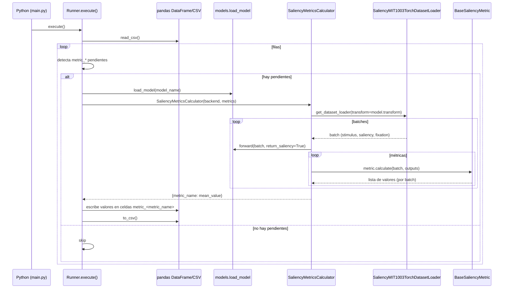

# Arquitectura (según el código actual)

## Estructura real
> Nota: este repo no usa un layout “src/” clásico de packaging; aquí `src/` es un **módulo top-level** importable como `src.*` (namespace package, sin `src/__init__.py`).

```
vit-human-alignment-framework/
  main.py
  data/
    vit-human-alignment-framework-test.csv
  src/
    cli/                 # placeholder (vacío por ahora)
    core/                # placeholder (vacío por ahora)
    dataset_loaders/
      base.py            # BaseDatasetLoader + BaseTorchDatasetLoader (DataLoader)
      saliency.py        # MIT1003 loader/dataset (Torch)
    metrics/
      __init__.py        # registry: load_metric(...)
      base.py            # BaseMetric, BaseSaliencyMetric, BaseMetricCalculator
      saliency.py        # métricas de saliency + SaliencyMetricsCalculator
      tid.py             # placeholder (vacío por ahora)
    models/
      __init__.py        # registry: load_model(...)
      base.py            # BaseModelAdapter + ForwardOutputs
      vit_b16.py         # ViT_B_16 (Torch, timm)
    runner/
      base.py            # Runner (CSV-driven)
    storage/
      base.py            # placeholder (incompleto)
    utils/
      common_enums.py    # BackendEnum
      common_types.py    # ExperimentSpec, ArrayLike
      common_utils.py    # METRIC_PREFIX, get_backend_device
```

## Responsabilidades por módulo
- **`src/models/`**: adapta modelos a una interfaz común. El adaptador es responsable de:
  - seleccionar dispositivo (`get_backend_device`)
  - cargar el modelo (`_load_model`)
  - exponer `forward(..., return_features, return_saliency)` y las ramas backend-specific.
- **`src/metrics/`**: define el contrato de métrica (`BaseMetric`) y el contrato de “calculator” (`BaseMetricCalculator`) que ejecuta sobre un dataset.
  - Las métricas actuales son de saliency y operan sobre tensores torch.
- **`src/dataset_loaders/`**: se encarga de iterar sobre datasets por batches (en Torch, construyendo un `DataLoader`).
- **`src/runner/`**: orquesta a partir del CSV:
  - detecta columnas de métricas vía `METRIC_PREFIX="metric_"`
  - identifica pendientes por celdas vacías
  - carga el modelo una vez por fila
  - agrupa métricas por tipo y ejecuta calculators (p.ej. saliency).
- **`src/utils/`**: enums, tipos y utilidades.
- **`src/cli/`, `src/core/`, `src/storage/`**: hoy son placeholders / incompletos.

## Diagrama de interacción (estado actual)

