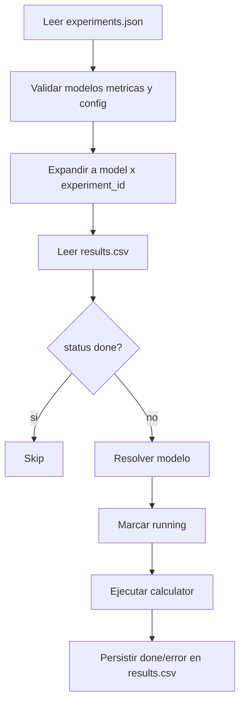

# CSV, JSON y Runner

## Dos flujos soportados

### 1. CSV legacy
- El CSV sigue siendo la fuente de verdad del flujo original.
- El runner detecta las métricas por el prefijo `metric_` (`METRIC_PREFIX`).
- La ejecución actualiza el mismo CSV in-place.

### 2. JSON recomendado
- El JSON describe qué experimentos se quieren ejecutar.
- `results.csv` guarda estado y resultados del flujo JSON.
- La reanudación se hace leyendo `results.csv` y saltando las ejecuciones ya marcadas como `done`.

> Importante: el flujo JSON no modifica el CSV legacy y el flujo CSV no escribe `results.csv`.

## Esquema mínimo del CSV (entrada = salida)
El runner legacy detecta las métricas por el prefijo `metric_` (`METRIC_PREFIX`).

Requeridos hoy:
- `model_name`: nombre del adaptador a cargar (p.ej. `vit-b16`).
- **Columnas de métricas**: una o más columnas cuyo nombre empiece por `metric_`.

Opcionales (permitidos, pero hoy no consumidos por los calculators):
- cualquier otra columna que quieras usar como “config por fila”: se incluye en `extra_config` (e.g. rutas, batch_size, flags).

Ejemplo tabular (simplificado):
```csv
model_name,metric_saliency_auc_judd,metric_saliency_pearson_correlation_coefficient
vit-b16,,
```

Una celda vacía en una columna `metric_*` significa “pendiente” y se intentará calcular en la ejecución.

## Convención columna → métrica
El código soporta dos formas:
- columna de CSV: `metric_<metric_name>`
- nombre interno: `<metric_name>`

Ejemplos reales (hoy implementados):
- `metric_saliency_auc_judd` → `saliency_auc_judd`
- `metric_saliency_pearson_correlation_coefficient` → `saliency_pearson_correlation_coefficient`

## Flujo de actualización del CSV
1. Leer CSV con pandas (o polars) en memoria.
2. Para cada fila:
   - Identificar métricas con celda vacía (pendientes).
   - Instanciar modelo una sola vez por fila.
   - Ejecutar calculators por tipo (hoy: saliency).
   - Escribir los resultados en sus celdas `metric_<metric_name>`.
3. Escribir CSV de vuelta:
   - Modo seguro: escribir a `csv_path.tmp` y reemplazar original.
   - Modo in-place: sobrescribir si el FS lo permite.

> Importante: en el código actual la escritura es “in-place” usando `df.to_csv(...)`. No hay aún modo tmp+replace ni lock.

## Reanudación
- Una fila puede estar parcialmente completa: las métricas con valor se saltan; sólo se ejecutan las celdas vacías.
- No hay reintentos automáticos dentro de la misma ejecución.
- Tampoco hay (todavía) un mecanismo de “estado” o “error_id” en el CSV en el runner actual.

## Flujo JSON: esquema conceptual

Estructura mínima:

```json
{
  "defaults": {
    "batch_size": 2
  },
  "dataset_defaults": {
    "levels": {
      "levels_path": "tests/data/levels",
      "imagenet_path": "tests/data/levels/images"
    },
    "visturing": {
      "data_path": "tests/data/visturing",
      "gt_path": "tests/data/visturing"
    }
  },
  "models": ["vit-b16", "timm::vit_base_patch16_224"],
  "experiments": [
    {
      "experiment_id": "levels-between",
      "metric": "levels_triplet_accuracy",
      "config": {"split": "between_class"}
    }
  ]
}
```

Reglas importantes:
- `defaults`: sólo claves realmente comunes a todas las métricas del archivo.
- `dataset_defaults`: configuración compartida por familia (`levels`, `visturing`, `tid`, `nights`, `saliency`).
- `experiments[].config`: overrides o parámetros específicos del experimento.
- `experiment_id`: identifica de forma estable cada variante de experimento.

## Validación del JSON

Antes de ejecutar, el runner valida:
- modelo válido;
- métrica válida;
- claves de config permitidas para esa métrica;
- valores permitidos para campos cerrados como `split`, `channel`, `freq`, etc.

Los errores devuelven opciones válidas cuando aplica.

## `results.csv` en el flujo JSON

Columnas principales:
- `run_key`
- `model_name`
- `experiment_id`
- `metric_name`
- `status`
- `result`
- `error`
- `config_hash`

Semántica:
- `run_key = model_name + "__" + experiment_id`
- `status=running`: ejecución empezada pero no finalizada
- `status=done`: resultado persistido, se salta en relanzamientos
- `status=error`: fallo persistido; por defecto no se reintenta

## Reanudación en el flujo JSON

- Si una ejecución ya está en `done`, no se repite.
- Si quedó en `running` por una interrupción, se vuelve a intentar.
- Si el mismo `experiment_id` aparece con otra config efectiva, `config_hash` detecta la inconsistencia y falla pronto.

## Extensión segura

El punto actual de verdad para el flujo JSON es:
- `src/runner/config_schema.py`: familias, claves permitidas y valores válidos;
- `src/runner/config_validation.py`: validación y mensajes de error;
- `src/models/resolver.py`: validación y resolución de modelos;
- `src/runner/base.py`: dispatch de ejecución.

## Diagrama de runner y CSV
```mermaid
flowchart TD
    A[Leer CSV] --> B[Detectar filas con métricas vacías]
    B --> C[Instanciar modelo]
    C --> D[Agrupar métricas por tipo]
    D --> E[Ejecutar calculator (p.ej. saliency)]
    E --> F[Iterar batches + model.forward(...)]
    F --> G[Calcular métricas + agregación]
    G --> H[Actualizar celdas metric_*]
    H --> I[Escribir CSV]
    G -->|excepción| J[Actualmente: aborta ejecución]
```

## Diagrama del flujo JSON


