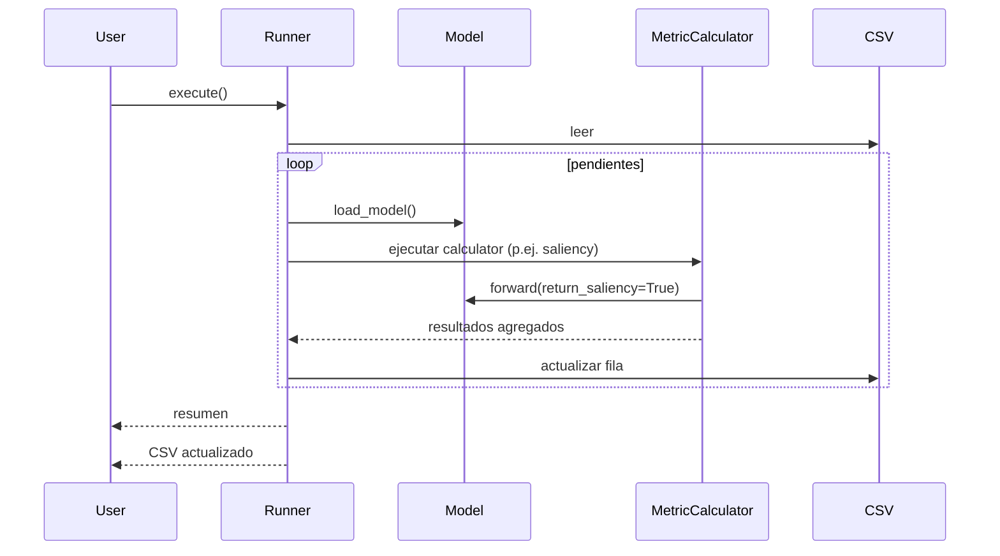

# Flujos de Ejecución

## Desde Python (API actual)
Hoy se ejecuta creando un `Runner` y llamando a `execute()`.

### Opción A: usar `main.py` (ejemplo del repo)
`main.py` instancia el runner con el CSV de ejemplo `data/vit-human-alignment-framework-test.csv` y ejecuta:
- `Runner(csv_path=...).execute()`

### Opción B: usar el runner directamente
Ejemplo conceptual:

```python
from src.runner.base import Runner
from src.utils.common_enums import BackendEnum

Runner(csv_path="data/experiments.csv", backend=BackendEnum.TORCH).execute()
```

Flujo:
1. Leer CSV.
2. Construir `ExperimentSpec` por fila (detectando columnas `metric_*`).
3. Detectar pendientes por celdas vacías.
4. Si hay pendientes:
   - Cargar el modelo (`models.load_model(model_name)`).
   - Instanciar métricas con el backend del modelo.
   - Ejecutar calculators (hoy: saliency).
5. Guardar CSV (in-place por defecto).



## Desde CLI
**No hay CLI implementada todavía**. El paquete `src/cli/` existe como placeholder.

Recomendación de implementación futura:
- Exponer un comando tipo `vit-align run --csv ...` que cree el `Runner` y delegue en `execute()`.

```mermaid
flowchart LR
    CLI[CLI (futuro)] --> Parse[Parse args]
    Parse --> Runner[Crear Runner]
    Runner --> Exec[execute]
    Exec --> CSV[Actualiza CSV único]
```
