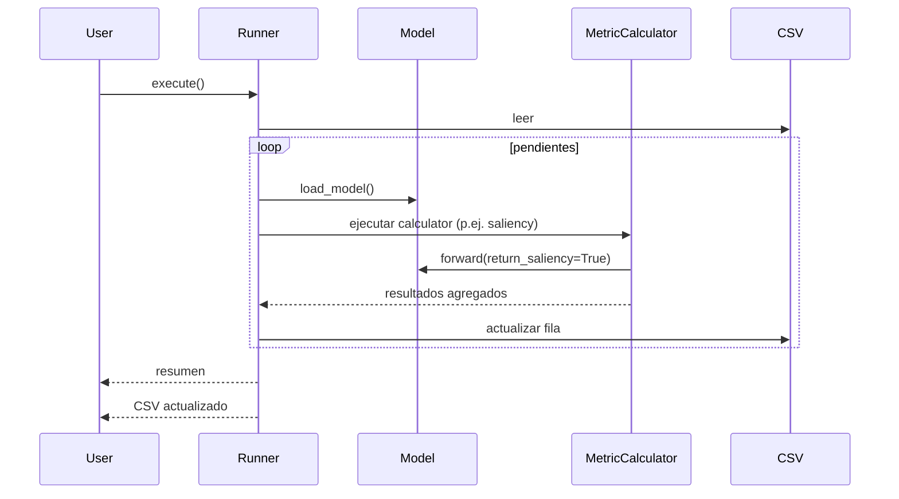
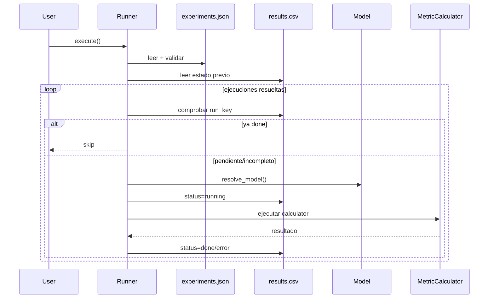

# Flujos de Ejecución

## Desde Python (API actual)
Hoy se ejecuta creando un `Runner` y llamando a `execute()`.

### Opción A: usar `main.py` (ejemplo del repo)
`main.py` instancia el runner con el CSV de ejemplo `data/vit-human-alignment-framework-test.csv` y ejecuta:
- `Runner(csv_path=...).execute()`

`main.py` sigue documentando el flujo legacy. El flujo JSON se invoca directamente desde Python.

### Opción B: usar el runner directamente
Ejemplo conceptual:

```python
from src.runner.base import Runner
from src.utils.common_enums import BackendEnum

Runner(csv_path="data/experiments.csv", backend=BackendEnum.TORCH).execute()
```

Flujo:
1. Leer CSV.
2. Construir `ExperimentSpec` por fila (detectando columnas `metric_*`).
3. Detectar pendientes por celdas vacías.
4. Si hay pendientes:
   - Cargar el modelo (`models.load_model(model_name)`).
   - Instanciar métricas con el backend del modelo.
   - Ejecutar calculators (hoy: saliency).
5. Guardar CSV (in-place por defecto).



### Opción C: usar el runner con JSON + `results.csv`

Ejemplo conceptual:

```python
from src.runner.base import Runner

Runner(
    json_path="data/experiments.example.json",
    results_path="results.csv",
).execute()
```

Flujo:
1. Leer `experiments.json`.
2. Validar modelos, métricas y config.
3. Expandir a ejecuciones atómicas `model + experiment_id`.
4. Leer `results.csv` si existe.
5. Para cada ejecución:
   - si está en `done`, saltarla;
   - si no, resolver el modelo;
   - marcar `running`;
   - ejecutar el calculator correcto;
   - persistir `done` o `error`.



## Reanudación

### CSV legacy
- reanuda por celdas vacías;
- no tiene estado explícito más allá del propio CSV.

### JSON + `results.csv`
- reanuda por `run_key` y `status`;
- evita repetir `done`;
- recupera `running` tras interrupciones;
- protege contra cambios silenciosos de config mediante `config_hash`.

## Modelos soportados

### Aliases internos
- `vit-b16`
- `vit-b32`
- `vit-l14`
- `vit-h14`

### Modelos de `timm`
- formato: `timm::<model_name>`
- ejemplo: `timm::vit_base_patch16_224`
- también admite checkpoints preentrenados explícitos de `timm`, por ejemplo:
  `timm::vit_base_patch16_224.augreg_in21k_ft_in1k`
  `timm::vit_base_patch16_224.mae`
  `timm::vit_base_patch16_clip_224.laion2b_ft_in1k`
- las opciones válidas dependen de la versión de `timm` instalada en el entorno actual
- si un modelo `timm` no tiene pesos preentrenados disponibles, el adapter lo carga con
  inicialización aleatoria y emite un `warning`

La validación del JSON usa `src/models/resolver.py` para aceptar o rechazar nombres de modelo.

## Puntos de extensión actuales

- `src/runner/config_schema.py`: declarar nuevas métricas, familias y opciones válidas.
- `src/runner/config_validation.py`: mensajes de error y validación final.
- `src/models/resolver.py`: aliases internos y resolución de modelos dinámicos.
- `src/runner/base.py`: conexión entre métrica validada y calculator real.

## Desde CLI
**No hay CLI implementada todavía**. El paquete `src/cli/` existe como placeholder.

Recomendación de implementación futura:
- Exponer un comando tipo `vit-align run --csv ...` que cree el `Runner` y delegue en `execute()`.

```mermaid
flowchart LR
    CLI[CLI (futuro)] --> Parse[Parse args]
    Parse --> Runner[Crear Runner]
    Runner --> Exec[execute]
    Exec --> CSV[Actualiza CSV único]
```
